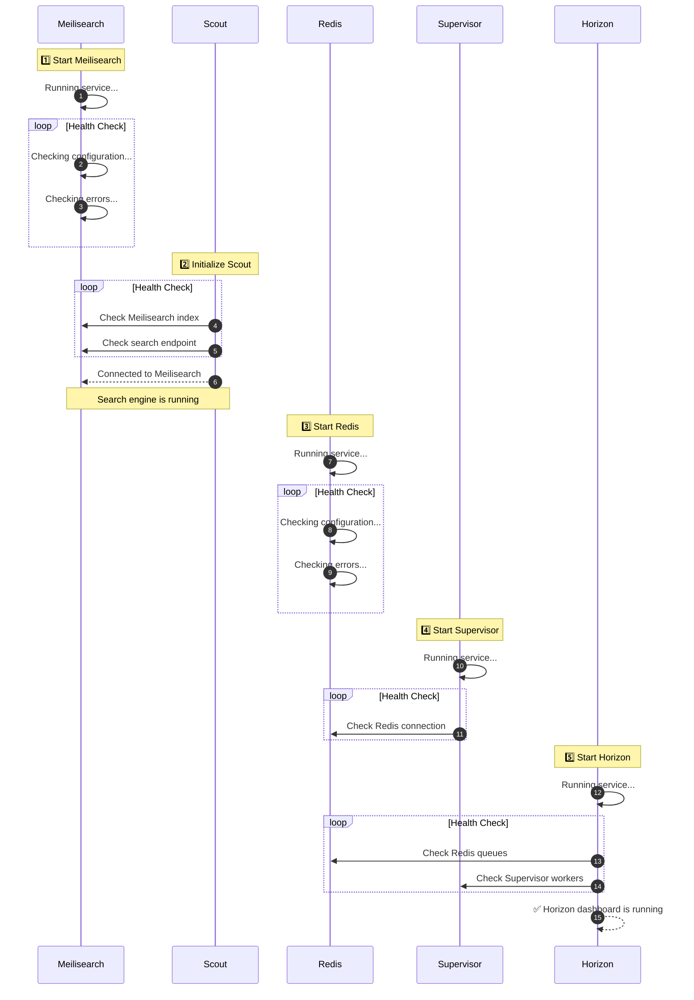

  

 

# AMLakas Documentation

Welcome to the documentation for this project.  
This directory contains setup and integration guides for core services that power the application.

---

## Available Service Guides

Each guide includes installation, configuration, troubleshooting, and notes.

- [:simple-redis: edis](services/redis.md)
- [:simple-meilisearch: eilisearch](services/meilisearch.md)
- 
- [:simple-laravel: Supervisor](services/supervisor.md)
- 

---

## How to Use

- Start with **Meilisearch** → for full-text search.
- Configure **Laravel Scout** → sync models with Meilisearch.
- Add **Redis** → base dependency for queues, caching, sessions.
- Setup **Supervisor** → keep queue workers/Horizon running in production.
- Enable **Horizon** → manage and monitor Redis queues with a dashboard.

---

---

## Notes

- Each guide is self-contained.
- Use these docs as both **setup reference** and **troubleshooting handbook**.
