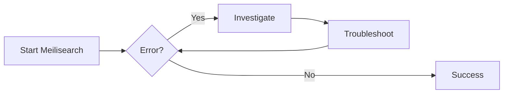

<div style="text-align: center;">
  
</div><br>

# Meilisearch

_A step-by-step guide on how to install, configure, and integrate Meilisearch with Laravel._

---

## Table of Contents

1. [Overview](#1-overview)
2. [Prerequisites](#2-prerequisites)
3. [Installation](#3-installation)
4. [Creating a Master Key](#4-creating-a-master-key)
5. [Running Meilisearch](#5-running-meilisearch)
6. [API Keys](#6-api-keys-for-api-access)
7. [Laravel Integration](#7-laravel-integration)
8. [Verification](#8-verification)
9. [Running as a Systemd Service (Production)](#9-running-meilisearch-as-a-systemd-service-production)
10. [Reverse Proxy with Nginx](#10-reverse-proxy-with-nginx)
11. [Troubleshooting](#11-troubleshooting)
12. [Notes](#12-notes)

---

## 1. Overview

This guide will help developers install **Meilisearch**, run the service, generate and use API keys, and connect it to a **Laravel project** for full-text search functionality.

By following this guide, you will learn:

- How to install Meilisearch in your environment
- How to run Meilisearch and manage API keys
- How to configure Laravel to use Meilisearch
- How to verify everything is working

---

## 2. Prerequisites

Before starting, ensure you have the following installed:

- **Windows(WSL2 for Dev stage) / Linux**
- **Laravel 9+** project with **Laravel Scout installed**

      - [Official Docs](https://laravel.com/docs/scout)
      - [Dev Docs](laravel-scout.md)

- PHP **8.1+**
- Composer installed
- Node.js (optional, if front-end indexing is needed)

---

## 3. Installation

```bash title="1. Download Meilisearch" linenums="1"
curl -L https://install.meilisearch.com | sh
```

```bash title="2. Move meilisearch to a global path" linenums="1"
sudo mv meilisearch /usr/local/bin/
```

```bash title="3. Verify Installation" linenums="1"
meilisearch --version
```

---

## 4. Creating a Master Key

Meilisearch requires a **master key** (minimum 16 characters) for authentication.  
You have two options:

---

=== "Generate Own Key (Recommended)"

    #### Generate Own Key

    You can generate a key in **two ways**:

      1. **Generate a secure random key** (recommended for production).
        ```bash title="1. Generate a secure random key" linenums="1" hl_lines="2 5"
        Run:
        openssl rand -base64 32

        Example output:
        A3hJf0m7t+UOYZqkK/98i1g9M+0zQhN0KmEY7UwhbDA=
        ```

      2. **Define your own key manually** (minimum 16 characters, good for development or testing).

        ```bash title="2. Define your own key manually" linenums="1"
        mySuperStrongKey_2025!
        ```

=== "Let Meilisearch Suggest One"

    #### Meilisearch Suggestion

    If you start Meilisearch **without specifying a master key**:

    ```bash title="Start Meilisearch" linenums="1"
    ./meilisearch
    ```

    It will run in **development mode** and display a randomly generated secure key in the logs, for example:

    ```bash title="Generated a secured master key" linenums="1"
    >> --master-key _NdU-sc7sDRdOg08yMoldhstrJoqpw94j_7AkCMH7lk <<
    ```

    1. Copy the generated master key.
    2. Stop Meilisearch (`CTRL + C`).
    3. Restart Meilisearch using the copied master key:
      ```bash title="Start Meilisearch with master key" linenums="1"
      ./meilisearch --master-key "_NdU-sc7sDRdOg08yMoldhstrJoqpw94j_7AkCMH7lk"
      ```

#### Save the key securely (e.g., in your `.env`):

```env title=".env" linenums="1"
MEILISEARCH_KEY=YOUR_MASTER_KEY
```

---

## 5. Running Meilisearch

```bash title="Start Meilisearch" linenums="1"
meilisearch --master-key="MASTER_KEY_EXAMPLE"

```

```bash title="Run in Background (Optional)" linenums="1"
nohup meilisearch --master-key="MASTER_KEY_EXAMPLE" > meilisearch.log 2>&1 &
```

---

## 6. API Keys (For API Access)

When you start Meilisearch with a **master key**, it automatically generates API keys for client access.  
These keys are only needed when you **interact with Meilisearch through its API** (not when starting the server).

- **Master Key** → Full access (set via `--master-key` when running Meilisearch)
- **Default API Keys** (created automatically after startup):
  - **Default Search API Key** → Restricted access (search-only operations)
  - **Default Admin API Key** → Full access (all API operations, same scope as master key but for API use)

You can list and retrieve all keys using:

```bash title="Run" linenums="1"
curl -H "Authorization: Bearer YOUR_MASTER_KEY" http://127.0.0.1:7700/keys
```

---

## 7. Laravel Integration

```bash title="1. Install Laravel Scout" linenums="1"
composer require laravel/scout

```

```bash title="2. Install Meilisearch PHP SDK" linenums="1"
composer require meilisearch/meilisearch-php http-interop/http-factory-guzzle
```

```php title="3. Configure config/scout.php" linenums="21"
'driver' => env('SCOUT_DRIVER', 'meilisearch'),
```

```env title="4. Add to .env" linenums="97"
SCOUT_DRIVER=meilisearch
MEILISEARCH_HOST=http://127.0.0.1:7700
MEILISEARCH_KEY=YOUR_MASTER_KEY

```

```php title="5. Use in Laravel Models" linenums="1"
use Laravel\Scout\Searchable;

class Post extends Model
{
    use Searchable;
}
```

```php title="6. Run indexing" linenums="1"
php artisan scout:import "App\Models\Post"

```

```php title="7. Search in code" linenums="1"
$posts = Post::search('keyword')->get();
```

---

## 8. Verification

- Visit: `http://127.0.0.1:7700` → should show Meilisearch landing page
- Run a test search:

      - Perform a search using the Meilisearch landing page.
      - Perform a search using the Name Screening feature.

---

## 9. Running Meilisearch as a Systemd Service (Production)

- To keep Meilisearch running in the background and auto-start on boot, set it up as a `systemd` service.

```bash title="1. Create Service File" linenums="1"
sudo nano /etc/systemd/system/meilisearch.service
```

- Paste the following content (update paths if needed):

```ini title="2. Add Configuration" linenums="1"
[Unit]
Description=Meilisearch
After=network.target

[Service]
User=meili
Group=meili
ExecStart=/usr/local/bin/meilisearch --master-key="MASTER_KEY_EXAMPLE"
Restart=always
LimitNOFILE=65536

[Install]
WantedBy=multi-user.target
```

> Replace `MASTER_KEY_EXAMPLE` with your real master key.
> For security, consider creating a dedicated user:
>
> ```bash
> sudo useradd -r -s /bin/false meili
> sudo chown meili:meili /usr/local/bin/meilisearch
>
> ```

```bash title="3. Reload systemd and Enable Service" linenums="1"
sudo systemctl daemon-reload
sudo systemctl enable meilisearch
sudo systemctl start meilisearch
```

```bash title="4. Check Status" linenums="1"
systemctl status meilisearch
```

- You should see it active (running).

```bash title="5. Check Logs" linenums="1"
journalctl -u meilisearch -f
```

---

## 10. Reverse Proxy with Nginx

You can run Meilisearch behind **Nginx** for easier access.  
The setup differs for **local development (WSL2)** vs **production servers**.

---

=== "Development Setup (WSL2 AlmaLinux)"

    #### Development Setup

    In WSL2, you can use Nginx to proxy Meilisearch to `http://localhost` or a custom domain via the Windows hosts file.
    SSL (Let’s Encrypt) is not practical in WSL2 because it requires a public IP.

    ```bash title="1. Install Nginx" linenums="1"
    sudo dnf install nginx -y
    sudo systemctl enable nginx   # Works only if systemd enabled
    sudo systemctl start nginx
    ```

    ```bash title="2-a. Create Meilisearch config" linenums="1"
    sudo nano /etc/nginx/conf.d/meilisearch.conf
    ```

    ```nginx title="2-b. Meilisearch configuration content" linenums="1"
    server {
        listen 80;
        server_name search.local;

        location / {
            proxy_pass         http://127.0.0.1:7700;
            proxy_set_header   Host $host;
            proxy_set_header   X-Real-IP $remote_addr;
            proxy_set_header   X-Forwarded-For $proxy_add_x_forwarded_for;
            proxy_set_header   X-Forwarded-Proto $scheme;
        }
    }
    ```

    ```pgsql title="3-a. Update Windows Hosts File" linenums="1"
    Edit `C:\Windows\System32\drivers\etc\hosts` on Windows:
    ```

    ```pgsql title="3-b. Windows Hosts File content" linenums="1"
    127.0.0.1 meilisearch.dev
    ```

    Now you can access Meilisearch at: http://meilisearch.dev

=== "Production Setup (AlmaLinux Server)"

    #### Production Setup

    On a live server with a public IP and DNS domain, you can secure Meilisearch with HTTPS.

    ```bash title="1. Install Nginx" linenums="1"
    sudo dnf install nginx -y
    sudo systemctl enable nginx
    sudo systemctl start nginx
    ```

    ```bash title="2-a. Create Meilisearch config" linenums="1"
    sudo nano /etc/nginx/conf.d/meilisearch.conf
    ```

    ```nginx title="2-b. Meilisearch configuration content" linenums="1"
    server {
        listen 80;
        server_name meilisearch.domain.com;

        location / {
            proxy_pass         http://127.0.0.1:7700;
            proxy_set_header   Host $host;
            proxy_set_header   X-Real-IP $remote_addr;
            proxy_set_header   X-Forwarded-For $proxy_add_x_forwarded_for;
            proxy_set_header   X-Forwarded-Proto $scheme;
        }
    }
    ```

    ```bash title="3. Test and Reload" linenums="1"
    sudo nginx -t
    sudo systemctl reload nginx
    ```

    Now available at: http://meilisearch.domain.com

---

#### Enable HTTPS (Let’s Encrypt)

```bash title="Install Certbot" linenums="1"
sudo dnf install certbot python3-certbot-nginx -y
```

```bash title="Run Certbot" linenums="1"
sudo certbot --nginx -d meilisearch.domain.com
```

Meilisearch will now be available securely at: https://meilisearch.domain.com

---

**Summary**

- **WSL2 (Development)** → Use http://localhost or fake domain via hosts file (no SSL).
- **Production** → Use real domain with Nginx + Let’s Encrypt for HTTPS.

---

## 11. Troubleshooting

- **Service not running**

  ```bash title="Check if Meilisearch is active" linenums="1"
  sudo systemctl status meilisearch
  ```

  ```bash title="or (if running manually)" linenums="1"
  ps aux | grep meilisearch
  ```

- **Port conflicts**

  ```bash title="Ensure nothing else is using 7700" linenums="1"
  sudo lsof -i :7700
  ```

- **Invalid API key**

  ```bash title="Confirm .env in Laravel uses the correct YOUR_MASTER_KEY" linenums="1"
  curl -H "Authorization: Bearer YOUR_MASTER_KEY" http://127.0.0.1:7700/health
  ```

  ```json title="Expected output" linenums="1"
  { "status": "available" }
  ```

- **Connection issues** → If Laravel/Scout can’t connect:

  - Verify Meilisearch is listening on `127.0.0.1:7700`.
  - If using Docker: confirm container is running and port mapped.
  - If using systemd: check firewall settings.

---

- **Diagram**



---

## 12. Notes

- Meilisearch is the actual search engine → Scout only acts as a bridge.
- Secure access → Always use a `masterKey` and configure API keys for read/write separation.
- Consider SSL/TLS → Run Meilisearch behind Nginx or Caddy with HTTPS for production.
- Monitor resource usage → Large datasets may require tuning memory/CPU allocation.
- Backup indexes → Regularly export data if using Meilisearch in production:

```bash title="Enables automatic database dumps" linenums="1"
meilisearch --dump-dir ./backups
```
