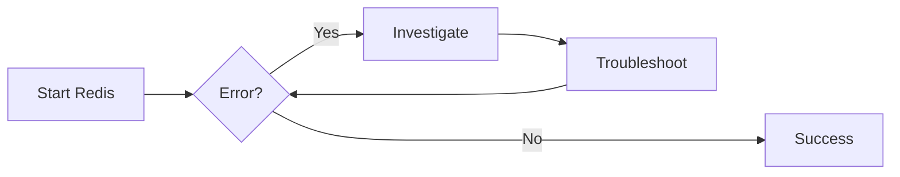

<div style="text-align: center;">
  
</div><br>

# Redis

_A step-by-step guide on how to install, configure, and connect Redis with Laravel._

---

## Table of Contents

1. [Overview](#1-overview)
2. [Prerequisites](#2-prerequisites)
3. [Installation](#3-installation)
4. [Running Redis](#4-running-redis)
5. [Testing Connection](#5-testing-connection)
6. [Laravel Integration](#6-laravel-integration)
7. [Verification](#7-verification)
8. [Running Redis as a Systemd Service (Production)](#8-running-redis-as-a-systemd-service-production)
9. [Troubleshooting](#9-troubleshooting)
10. [Notes](#10-notes)

---

## 1. Overview

This guide helps developers set up **Redis** for use in Laravel projects — mainly for **queues and sessions**.  
It covers installation, starting the server, testing the connection, and integrating with Laravel.

---

## 2. Prerequisites

- **WSL2 AlmaLinux** (for dev) OR **AlmaLinux server** (for production)
- PHP **8.1+**
- **Composer** installed
- **Laravel 9+**
- **Redis PHP extension (`php-redis`)**

---

## 3. Installation

```bash title="Install Redis" linenums="1"
sudo dnf install redis -y
```

```bash title="Install PHP Redis Extension" linenums="1"
sudo dnf install php-pecl-redis -y
```

---

## 4. Running Redis

```bash title="Start Redis (Foreground, Dev)" linenums="1"
redis-server
```

```bash title="Run with systemctl (if systemd enabled)" linenums="1"
sudo systemctl start redis
sudo systemctl enable redis
```

---

## 5. Testing Connection

```bash title="A. Use Redis CLI" linenums="1"
redis-cli ping

Expected response:
PONG
```

```bash title="Set/Get a Key" linenums="1"
redis-cli set foo bar
redis-cli get foo
```

---

## 6. Laravel Integration

#### 1. Install Laravel Redis Client (PHPRedis)

- Laravel natively supports **phpredis** (faster, recommended).
- Ensure the `php-redis` extension is installed:

```bash title="Install PHP Redis Extension" linenums="1"
sudo dnf install php-pecl-redis -y
```

#### 2. Configure `.env`

```env title=".env" linenums="31"
SESSION_DRIVER=redis
QUEUE_CONNECTION=redis

REDIS_HOST=127.0.0.1
REDIS_PASSWORD=null
REDIS_PORT=6379
```

#### 3. Update Laravel Configuration (Optional)

Laravel automatically uses phpredis if installed, but you can explicitly set it in **config/database.php**:

```php title="config/database.php" linenums="144" hl_lines="3"
'redis' => [

    'client' => 'phpredis',

    'default' => [
        'url' => env('REDIS_URL'),
        'host' => env('REDIS_HOST', '127.0.0.1'),
        'password' => env('REDIS_PASSWORD', null),
        'port' => env('REDIS_PORT', 6379),
        'database' => env('REDIS_DB', 0),
    ],

],
```

---

## 7. Verification

```bash title="Test Laravel queue worker" linenums="1"
php artisan queue:work redis
```

---

## 8. Running Redis as a Systemd Service (Production)

```bash title="Start and enable Redis on boot" linenums="1"
sudo systemctl enable redis
sudo systemctl start redis
```

```bash title="Check status" linenums="1"
systemctl status redis
```

```bash title="Check logs" linenums="1"
journalctl -u redis -f
```

---

## 9. Troubleshooting

- **`redis-cli ping` returns (error) `Could not connect`**  
  → Ensure Redis is running (`systemctl status redis` or `ps aux | grep redis`).  
  → Check if Redis is bound to `127.0.0.1` in `/etc/redis.conf`.

---

- **Port 6379 already in use**  
  → Another process is occupying the Redis port.

  ```bash title="Find it with" linenums="1"
  sudo lsof -i :6379
  ```

→ Kill or stop the conflicting service, then restart Redis.

---

- **Laravel queue jobs stuck / not processing**
  → Make sure the queue worker is running:

  ```bash title="Run queue worker" linenums="1"
  php artisan queue:work redis
  ```

  → Check `storage/logs/laravel.log` for job errors.

---

- **Redis not persisting data**
  → Verify persistence settings in `/etc/redis.conf` (`appendonly yes` or snapshot settings).

---

- **Authentication errors**
  → If `requirepass` is enabled in `redis.conf`, set `REDIS_PASSWORD` in `.env` and restart Laravel.

---

- **(Local Development) WSL2 connection issues**
  → If running in WSL2, ensure you connect to `127.0.0.1` and Redis is running inside the same WSL distro (not on Windows natively unless exposed).

---

- **Diagram**



---

## 10. Notes

=== "Development (WSL2 - AlmaLinux)"

    - You may not have systemd enabled, so run Redis manually with redis-server & or use nohup.
    - Ensure port 6379 is free.

=== "Production"

    - Always secure Redis (bind to 127.0.0.1 only in /etc/redis.conf).
    - Use a firewall or authentication for remote connections.
    - Monitor with redis-cli info.
